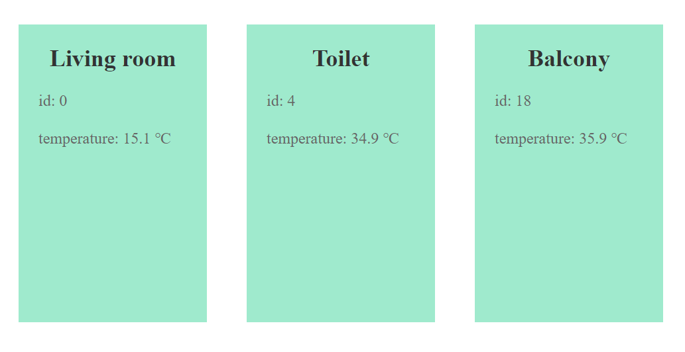

# myheat

React app for getting and updating information about
temperature in different rooms



## Install

```
npm install
```

## Start

Runs the app in the development mode.

```
npm start
```
Open [http://localhost:3000](http://localhost:3000) to view it in your browser.
